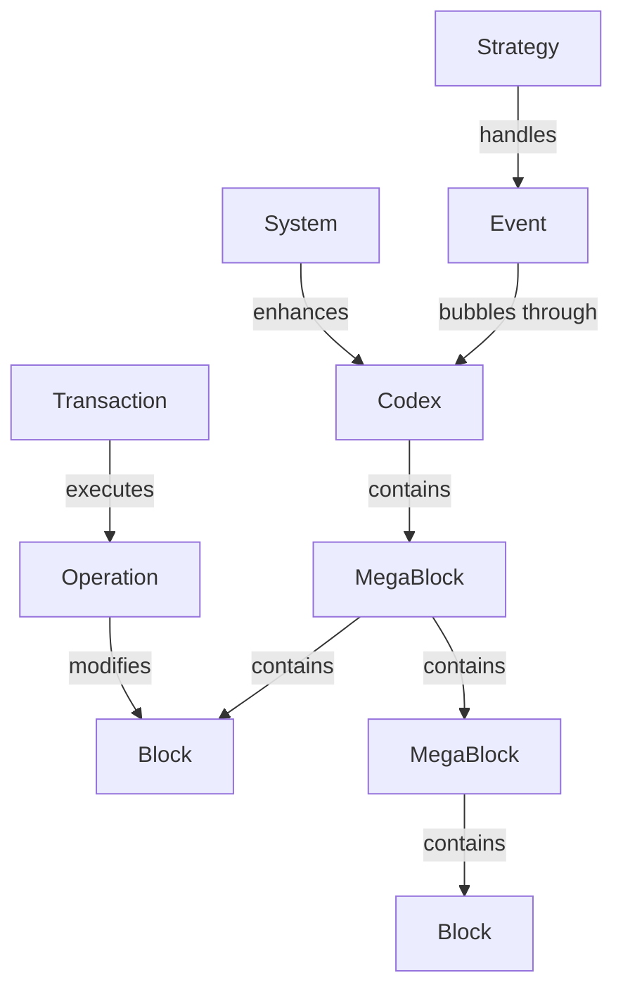

# 🚀 Codex Editor

> **The modular block editor that respects the browser.**  
> One editor, everywhere. From a simple textarea to a full Notion-like experience.

<div align="center">

[](https://www.npmjs.com/package/@aionbuilders/codex)
[](https://bundlephobia.com/package/@aionbuilders/codex)
[](https://opensource.org/licenses/MIT)
[](https://svelte.dev)
[]()

**[Demo](https://codex-demo.com)** • **[Docs](https://docs.codex.dev)** • **[Playground](https://play.codex.dev)**

</div>

---

## ✨ Why Codex?

### The Problem with Existing Editors

| Editor | Approach | Problem |
|--------|----------|---------|
| **ProseMirror/Slate** | Single contenteditable, virtual blocks | No real visual blocks, complex API, huge bundle |
| **Editor.js** | Multiple contenteditables, real blocks | Broken browser behavior (spellcheck, selection, IME) |
| **Quill/TipTap** | Single contenteditable, flat structure | Hard to extend, not truly modular |

### The Codex Solution

**Single ContentEditable + Real Blocks + Svelte 5 Reactivity = 🔥**

```
Your content structure:        What users edit:         What devs work with:
┌─────────────────┐            ┌─────────────────┐      class Paragraph {
│ Paragraph       │            │ [Single         │        children = [
│ ├── Text        │     →      │  ContentEdit-   │   →      Text("Hello"),
│ ├── Linebreak   │            │  able]          │           Linebreak(),
│ └── Text        │            │                 │           Text("World")
└─────────────────┘            └─────────────────┘        ]
                                                         }
Real blocks                    Native behavior          Clean API
```

---

## 🎯 Core Features

### 🧩 **True Modularity**
Start at 20kb, scale to whatever you need.

### ⚡ **Svelte 5 Powered**
Fine-grained reactivity with runes. No virtual DOM overhead.

### 📦 **Progressive Enhancement**
Same API from textarea replacement to Google Docs competitor.

### 🔄 **Transaction System**
Every change is reversible. Automatic rollback on errors.

### 🎨 **Extensible Architecture**
Blocks, Strategies, Systems, Presets - compose your perfect editor.

### 🌍 **Universal**
Works everywhere: forms, comments, chat, documents, emails, and more.

---

## 🚦 Quick Start

### Installation

```bash
npm install @aionbuilders/codex
```

### Choose Your Fighter

#### 1️⃣ **Plain Text** (5kb) - Replace any textarea
```javascript
import { Codex } from '@aionbuilders/codex';
import { PlainPreset } from '@aionbuilders/codex/presets';

const editor = new Codex({
  preset: PlainPreset,  // Just text, no formatting
  element: '#my-textarea'
});
```

#### 2️⃣ **Markdown** (15kb) - For comments & notes
```javascript
import { Codex } from '@aionbuilders/codex';
import { MarkdownPreset } from '@aionbuilders/codex/presets';

const editor = new Codex({
  preset: MarkdownPreset,  // Bold, italic, links, code
  element: '#comment-box',
  config: {
    singleParagraph: true,
    maxLength: 500
  }
});
```

#### 3️⃣ **Rich Text** (35kb) - Full document editor
```javascript
import { Codex } from '@aionbuilders/codex';
import { RichPreset } from '@aionbuilders/codex/presets';

const editor = new Codex({
  preset: RichPreset,  // All formatting, multiple blocks
  element: '#document-editor'
});
```

#### 4️⃣ **Custom** - Pick exactly what you need
```javascript
import { Codex } from '@aionbuilders/codex';
import { PlainPreset } from '@aionbuilders/codex/presets';

const editor = new Codex({
  preset: PlainPreset.extend({
    capabilities: {
      text: { 
        styles: ['bold', 'italic'],  // Only these styles
        shortcuts: true               // Ctrl+B, Ctrl+I
      }
    }
  })
});
```

---

## 🏗️ Architecture

### Core Concepts



### The Block Hierarchy

```javascript
Block                    // Base class - atomic content unit
  ├── Text              // Leaf block - actual text content
  ├── Linebreak         // Leaf block - <br> element
  └── MegaBlock         // Container - can have children
      ├── Paragraph     // Container for text/linebreaks
      ├── List          // Container for list items
      └── Codex         // Root container
```

### Reactive Coordinates

Every block knows its position automatically:

```javascript
class Text extends Block {
  // These update automatically when content changes!
  start = $derived(this.before?.end ?? 0);
  end = $derived(this.start + this.text.length);
  selected = $derived(/* selection logic */);
}
```

### Transaction System

All mutations are atomic and reversible:

```javascript
// Every operation can be rolled back
const tx = codex.tx([
  new TextEdit(block, { from: 0, to: 5, text: 'Hello' }),
  new BlockInsert(parent, { blocks: [...], offset: 2 })
]);

try {
  await tx.execute();  // Atomic execution
} catch (error) {
  // Automatic rollback on error!
}
```

### Strategy Pattern

Complex behaviors without spaghetti:

```javascript
// Define reusable behaviors
const multiBlockDeleteStrategy = new Strategy(
  'delete-across-blocks',
  (codex, context) => {
    // Can I handle this?
    return context.key === 'Backspace' && codex.selection.isMultiBlock;
  },
  (codex, context) => {
    // Handle it
    codex.tx(/* operations */).execute();
  }
).tag('keydown', 'delete', 'multi-block');
```

---

## 📦 Presets

| Preset | Size | Use Case | Includes |
|--------|------|----------|----------|
| **PlainPreset** | ~5kb | Textarea replacement | Text input, linebreaks |
| **MarkdownPreset** | ~15kb | Comments, notes | Bold, italic, code, links |
| **ChatPreset** | ~12kb | Messaging | Single line, emoji, mentions |
| **RichPreset** | ~35kb | Documents | All formatting, lists, headings |

### Creating Custom Presets

```javascript
import { Preset } from '@aionbuilders/codex';
import { Paragraph, Heading, List } from '@aionbuilders/codex/blocks';
import { BoldStrategy, ItalicStrategy } from '@aionbuilders/codex/strategies';

export const MyPreset = new Preset({
  name: 'my-company-preset',
  blocks: [Paragraph, Heading, List],
  strategies: [BoldStrategy, ItalicStrategy],
  config: {
    text: {
      styles: ['bold', 'italic', 'underline'],
      maxLength: 5000
    },
    shortcuts: {
      bold: 'Cmd+B',
      italic: 'Cmd+I'
    }
  }
});
```

---

## 🎮 Real-World Examples

### Form Input
```javascript
// Auto-expanding textarea with character limit
new Codex({
  preset: PlainPreset,
  element: '#bio',
  config: {
    maxLength: 500,
    placeholder: 'Tell us about yourself...',
    autoResize: true
  }
});
```

### Comment System
```javascript
// GitHub-style markdown comments
new Codex({
  preset: MarkdownPreset,
  element: '#comment',
  plugins: [MentionsPlugin, EmojiPlugin],
  config: {
    singleParagraph: true,
    onSubmit: (content) => submitComment(content)
  }
});
```

### Chat Interface
```javascript
// Slack-like message input
new Codex({
  preset: ChatPreset,
  element: '#message-input',
  config: {
    enterSends: true,
    multiline: 'shift+enter',
    typing: (isTyping) => sendTypingIndicator(isTyping)
  }
});
```

### Document Editor
```javascript
// Full Notion-like experience
new Codex({
  preset: RichPreset,
  element: '#editor',
  plugins: [
    CollaborationPlugin,
    AutosavePlugin,
    SlashCommandsPlugin
  ]
});
```

---

## 🔌 Creating Custom Blocks

### Simple Block
```javascript
import { Block } from '@aionbuilders/codex';

class Quote extends Block {
  static manifest = {
    type: 'quote',
    capabilities: ['editable', 'stylable']
  };

  author = $state('');
  
  get values() {
    return {
      text: this.text,
      author: this.author
    };
  }
}
```

### Container Block
```javascript
import { MegaBlock } from '@aionbuilders/codex';

class Callout extends MegaBlock {
  static manifest = {
    type: 'callout',
    blocks: [Paragraph, List],  // What it can contain
    capabilities: ['nestable']
  };

  emoji = $state('💡');
  color = $state('yellow');
}
```

---

## 📊 Performance

| Metric | Target | Codex | ProseMirror | Slate |
|--------|--------|-------|-------------|-------|
| First input | <50ms | ✅ 10ms | 45ms | 60ms |
| 1000 blocks render | <100ms | ✅ 80ms | 120ms | 200ms |
| Bundle size (min) | - | 20kb | 200kb | 100kb |
| Memory (1000 blocks) | <50MB | ✅ 30MB | 45MB | 55MB |

---

## 🗺️ Roadmap

### ✅ Implemented (v0.1-alpha)
- [x] Single ContentEditable architecture
- [x] Block system with hierarchy
- [x] Transaction system with rollback
- [x] Strategy pattern for behaviors
- [x] Basic paragraph/text editing
- [x] Selection management
- [x] Reactive coordinate system

### 🚧 In Progress (v0.2-alpha)
- [ ] Multi-block selection operations (40%)
- [ ] Copy/paste system (0%)
- [ ] Text styling (structure ready, UI needed)
- [ ] Undo/redo (history ready, shortcuts needed)

### 📋 Planned (v1.0)
- [ ] Preset system (Plain, Markdown, Rich)
- [ ] Plugin architecture
- [ ] Virtual scrolling
- [ ] Touch/mobile support
- [ ] Accessibility (ARIA)
- [ ] Serialization formats (HTML, Markdown, JSON)

### 🚀 Future (v2.0+)
- [ ] Collaborative editing (CRDT)
- [ ] AI integrations
- [ ] Voice input
- [ ] Table support
- [ ] Code syntax highlighting
- [ ] Math equations
- [ ] Drawing/diagrams

---

## 🤝 Contributing

We need help! The architecture is solid, but there's lots to build.

### Priority Areas

🔥 **Critical**
- Multi-block selection edge cases
- Copy/paste HTML sanitization
- Mobile/touch support

🎯 **Good First Issues**
- Text styling UI (buttons for bold/italic)
- Keyboard shortcuts
- New block types (lists, headings)

🧪 **Testing Needed**
- Selection edge cases
- Large document performance
- Browser compatibility

### Development Setup

```bash
# Clone and install
git clone https://github.com/aionbuilders/codex
cd codex
npm install

# Start dev server
npm run dev

# Run tests
npm test

# Build library
npm run build
```

### Project Structure
```
src/lib/
├── states/          # Core state (the brain 🧠)
│   ├── codex.svelte.js
│   ├── block.svelte.js
│   ├── selection.svelte.js
│   └── blocks/
│       ├── text.svelte.js
│       └── paragraph.svelte.js
├── components/      # Svelte UI (the face 😊)
├── strategies/      # Behavior handlers
├── systems/         # Cross-cutting features
├── presets/        # Ready-to-use configs
└── utils/          # Helpers
```

---

## 📖 API Reference

### Core API

```javascript
const codex = new Codex(options);

// Content manipulation
codex.getValue();                    // Get content
codex.setValue(content);             // Set content
codex.clear();                       // Clear all

// Focus & selection
codex.focus();                       // Focus editor
codex.select(start, end);           // Select range
codex.getSelection();               // Get selection

// Transactions
codex.tx(operations).execute();     // Execute operations
codex.undo();                       // Undo last
codex.redo();                       // Redo

// Events
codex.on('change', handler);        // Content change
codex.on('selectionchange', handler); // Selection change
```

---

## 🙏 Philosophy

1. **Respect the browser** - Work with native APIs, not against them
2. **Progressive enhancement** - Start simple, scale as needed
3. **Explicit over magic** - Clear, predictable behavior
4. **Performance first** - Every millisecond counts
5. **Developer joy** - Clean API, great DX

---

## 📜 License

MIT © [Aion Builders](https://aion.builders) & [Killian Di Vincenzo](https://killiandvcz.fr)

---

<div align="center">

### 💬 Community

[Discord](https://discord.gg/codex) • [Twitter](https://twitter.com/codexeditor) • [GitHub Discussions](https://github.com/aionbuilders/codex/discussions)

### ⚠️ Alpha Warning

This is experimental software under heavy development.  
APIs will change. Bugs exist. Dragons lurk.

**But the vision is clear: One editor, everywhere.**

</div>